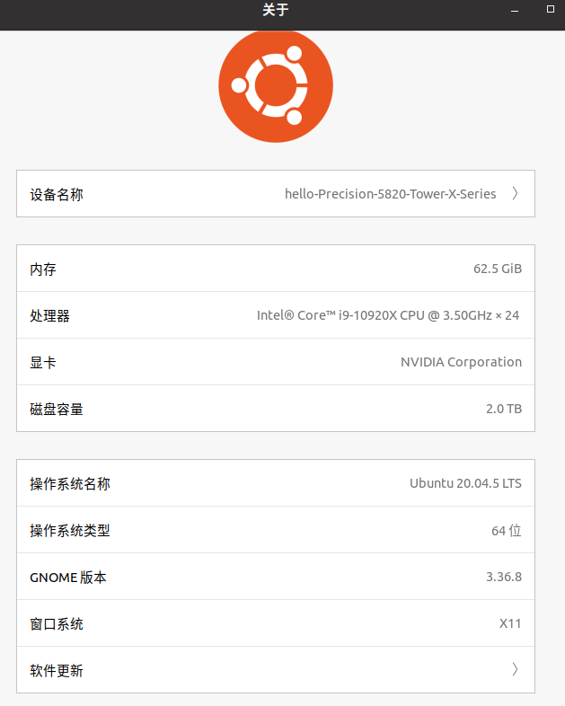
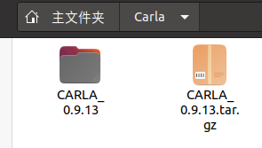

2023.1.12

用了两天，实现了Autoware.universe与Carla 0.9.13的联合仿真，本文用于记录本次仿真的过程

参考文章：[Autoware.Universe：如何在Carla 0.9.13上运行](https://blog.csdn.net/robotpengxu/article/details/127975566?spm=1001.2014.3001.5502)

[Autoware.universe 和 carla simulator 联合仿真](https://blog.csdn.net/aerbeisishan2008/article/details/127064532?ops_request_misc=%257B%2522request%255Fid%2522%253A%2522167351395016800186561214%2522%252C%2522scm%2522%253A%252220140713.130102334..%2522%257D&request_id=167351395016800186561214&biz_id=0&utm_medium=distribute.pc_search_result.none-task-blog-2~all~sobaiduend~default-1-127064532-null-null.142^v70^one_line,201^v4^add_ask&utm_term=Autoware.Universe&spm=1018.2226.3001.4187)

# 硬件配置



python版本：3.8

显卡：Nvidia RTX3080 驱动470.16（可以使用高版本，本电脑由于其他软件需要较低版本的驱动所以才用的470.16）

CUDA：11.4

ROS2 galactic

# 安装前的准备

## pip更新

注意，python3.8也可以使用Carla的python库，不需要更换版本

如果因为更换python版本导致GNOME终端打不开的，可以参考[以下解决方法](https://blog.csdn.net/weixin_46584887/article/details/120702843)：

```
cd /usr/bin
ls python*
```

可以看到目录下有 python3.8 文件（视你们自己电脑 python 版本情况定），删除原有 python3 文件：

```
sudo rm ./python3
```

复制 python 发行版文件命名为 python3，问题解决：

```
sudo cp ./python3.8 ./python3
```

注：python发行版即使用sudo apt-get install python3安装的版本


有一步很关键，就是需要pip3的版本大于20.3

```
 # For Python 3
 pip3 -V

 # For Python 2
 pip -V
```

升级pip

```
 # For Python 3
 pip3 install --upgrade pip

 # For Python 2
 pip install --upgrade pip
```

本机安装ubantu20.04，其默认pip3版本就是pip20.0.2，不符合要求

所以需要升级pip3，按照官方提供的命令，进行升级，结果报错如下：

看到结尾的Successfully installed pip-22.2.2 ，我以为升级成功，故进行下一步验证：

结果仍是pip20.0.2，升级失败


解决方法：

```
gedit ~/.bashrc
```

打开后在末尾添加：

export PATH=/home/cxx/.local/bin/:$PATH

保存后输入

```
source ~/.bashrc 
```

成功：


## 安装pygame numpy

```
pip install --user pygame numpy &&
pip3 install --user pygame numpy
```

## 安装依赖包

后面运行脚本时ModuleNotFoundError No module named ‘xxx‘这个东西卡了我很久，主要原因是少了一些python依赖包

使用pip3来安装依赖包，注意由于后续使用python3，所以必须是pip3

后续运行脚本如果还有报错的话，缺什么装什么

```
pip3 install xxx -i https://xxx.xx.org/simple

# 比如下面是清华的源

# https://mirrors.tuna.tsinghua.edu.cn/pypi/web/simple/
```

主要缺少的包有：

行为树库py_trees

```
pip3 install py_trees -i https://mirrors.tuna.tsinghua.edu.cn/pypi/web/simple/
```

networkx

```
pip3 install networkx -i https://mirrors.tuna.tsinghua.edu.cn/pypi/web/simple/
```

sensor_msgs_py，这个库的安装指令不一样，可以[参考stackflow上的一篇帖子](https://stackoverflow.com/questions/71225376/modulenotfounderror-no-module-named-sensor-msgs-py)

```
sudo apt-get install ros-galactic-sensor-msgs-py
```

等等

## 下载Carla

[下载地址](https://github.com/carla-simulator/carla/releases/tag/0.9.13/)

觉得慢的可以用[国内地址，CSDN同步](https://gitcode.net/mirrors/carla-simulator/carla?utm_source=csdn_github_accelerator)，下载0.9.13	

# 安装Carla

可以参考：https://blog.csdn.net/weixin_43149506/article/details/126337966

不需要编译

[Carla官方Github](https://github.com/carla-simulator/carla)

[国内地址，CSDN同步](https://gitcode.net/mirrors/carla-simulator/carla?utm_source=csdn_github_accelerator)

下载之后解压即可使用



可以验证一下：其中-world-port 必须设置为2000，这个端口和后面的openplanner通讯有关

```
$ cd ~/Carla/CARLA_0.9.13
$ ./CarlaUE4.sh -quality-level=Epic -world-port=2000 -resx=800 -resy=600
```

效果：


**可能的报错：**

CARLA/CARLA_0.9.13/CarlaUE4/Binaries/Linux/CarlaUE4-Linux-Shipping: error while loading shared libraries: libomp.so.5: cannot open shared object file: No such file or directory

解决方法

```
sudo apt-get install libomp5
```


cd到你的Carla目录，运行：

```
cd path/to/carla/root

./ImportAssets.sh
```

## 安装和使用 CARLA 客户端库

```
 # Python 3
 pip3 install carla

 # Python 2
 pip install carla
```

再次运行Carla

```
cd ~/Carla/CARLA_0.9.13
./CarlaUE4.sh -quality-level=Epic -world-port=2000 -resx=800 -resy=600
```

出现报错：


原因：CARLA强制使用了集成显卡，而没有使用NVIDIA显卡。

通过如下命令，可以正常运行：

```
./CarlaUE4.sh -prefernvidia
```

示例演示：

```
# Terminal A 
cd PythonAPI\examples

python3 -m pip install -r requirements.txt # Support for Python2 is provided in the CARLA release packages

python3 generate_traffic.py  

# Terminal B
cd PythonAPI\examples

python3 manual_control.py 
```

等待所有依赖安装完成，将会生成随机交通流和一辆可以通过按下WASD控制的车辆

卡顿问题解决

设置启动项

```
cd ~/CARLA/CARLA_0.9.13
./CarlaUE4.sh -prefernvidia -quality-level=Low -benchmark -fps=15
```

2.隐藏房屋建筑，仅留下道路，减少显卡渲染的任务量

方法：Shift+V 全选建筑物  Shift+B 隐藏所有建筑物

补充

配置选项可用：

    carla-rpc-port=N：侦听端口 N 处的客户端连接。默认情况下，流式端口 Streaming port 设置为 N+1；
    carla-streaming-port=N：指定用于传感器数据流的端口。 使用 0 获取随机未使用的端口。 第二个端口将自动设置为 N + 1；
    quality-level={Low,Epic}：更改图形质量级别；
    -carla-server：让 carla以服务的方式运行；
    -benchmark -fps=15：引擎以1/15秒的固定时间逐步运行；
    -windowed -ResX=800 -ResY=600：屏幕窗口大小；
# 编译Openplanner

如果以前已经装好了Autoware.universe的，可以只下载Openplanner包并重新编译

clone 相关open_planner源码，地址：https://github.com/ZATiTech/open_planner

cd到external目录

```
cd /home/your dir/autoware/src/universe/external
```

```
git clone https://github.com:ZATiTech/open_planner.git
```

重新编译autoware

```
$ colcon build --symlink-install --cmake-args -DCMAKE_BUILD_TYPE=Release
```

如果你没有装过autoware，可以直接下载带openplanner的autoware，安装步骤除了第一步不一样，其他完全一致

```
$ cd ~
$ mkdir autoware
$ cd autoware
$ git clone https://github.com/ZATiTech/autoware.universe.openplanner.git -b open-planner
```

## 安装op_agent、op_bridge和scenario_runner

包地址为：[hatem-darweesh (Hatem Darweesh) · GitHub](https://github.com/hatem-darweesh) 

cd /home/your dir/carla-autoware-universe/

注：目录随意

mkdir op_carla

cd op_carla

1、clone op_agent (ros2分支)

git clone -b ros2 https://github.com/hatem-darweesh/op_agent.git

2、clone op_bridge(ros2分支)

git clone -b ros2 https://github.com/hatem-darweesh/op_bridge.git

3、clone scenario_runner(openplanner_carla_bridge分支)

git clone -b openplanner_carla_bridge https://github.com/hatem-darweesh/scenario_runner.git 

# 下载Carla高精地图数据

```
$ cd ~/autoware
$ mkdir map_data
$ git clone https://bitbucket.org/carla-simulator/autoware-contents.git
```

同样，这里的目录随意，方便起见可以放在autoware目录下，如果这个方式下载太慢，可以尝试以下的方式

链接:https://pan.baidu.com/s/1Jmz93TgFQWGQxV49oAHQrw 密码:kpcq

是https://blog.csdn.net/robotpengxu上传的链接

下载

- autoware-contents
- darknet

首先去覆盖**op_agent** 下两个同名文件夹

然后，把点云地图和lanelet2地图数据放到map_data下，我们测试用到了**Town01**，就把在map_data下**新建一个Town01文件夹**，复制Town01的两个地图数据并把地图**改成如下的名字**


# 设置环境变量

在~/.bashrc中，设置环境变量

注意把your xxx Dir改成你的目录

```
export CARLA_ROOT=~/your Carla Dir/CARLA_0.9.13
export SCENARIO_RUNNER_ROOT=~/your Dir/scenario_runner
export LEADERBOARD_ROOT=~/your Dir/op_bridge
export TEAM_CODE_ROOT=~/your Dir/op_agent
export PYTHONPATH=$PYTHONPATH:${CARLA_ROOT}/PythonAPI
export PYTHONPATH=$PYTHONPATH:${CARLA_ROOT}/PythonAPI/util
export PYTHONPATH=$PYTHONPATH:${CARLA_ROOT}/PythonAPI/carla
export PYTHONPATH=$PYTHONPATH:${CARLA_ROOT}/PythonAPI/carla/agents
export PYTHONPATH=$PYTHONPATH:${CARLA_ROOT}/PythonAPI/carla/dist/carla-0.9.13-py3.7-linux-x86_64.egg
```

# 修改脚本文件

1. **op_bridge/op_scripts/run_exploration_mode_ros2.sh**

注释掉原来的，改成localhost

```
export SIMULATOR_LOCAL_HOST="localhost"
# export SIMULATOR_LOCAL_HOST="192.168.11.5"
```

2. **op_agent/start_ros2.sh**

注意把user改成你的Ubuntu用户名

```
source /home/user/hatem-repos/autoware-universe/autoware/install/setup.bash
```

替换为

```
source /home/user/workspaces/autowarefoundation/autoware.universe.openplanner/install/setup.bash
```

以及

```
ros2 launch /home/hatem/hatem-repos/autoware-universe/autoware/src/launcher/autoware_launch/autoware_launch/launch/autoware.launch.xml map_path:=/home/hatem/Data/autoware_uni_sample_data/${map_name} vehicle_model:=sample_vehicle sensor_model:=sample_sensor_kit
```

替换为

```
ros2 launch /home/user/autoware/src/launcher/autoware_launch/autoware_launch/launch/autoware.launch.xml map_path:=/home/user/autoware/map_data/${map_name} vehicle_model:=sample_vehicle sensor_model:=sample_sensor_kit
```

注意，**不允许使用~代替/home/user**，否则会读取不到高精地图。注意把autoware更换成你的autoware目录

现在可以尝试一下打开Autoware

先打开Carla，如果电脑配置不好， 可以设置为 -quality-level=low

```
$ cd ~/Carla/CARLA_0.9.13
$ ./CarlaUE4.sh -quality-level=Epic -world-port=2000 -resx=800 -resy=600
```

等加载完成之后，打开autoware

```
$ source ~/autoware/install/setup.bash
$ cd ~/op_carla/op_bridge/op_scripts
$ ./run_exploration_mode_ros2.sh
```

这里可能会报错，一般是少了什么py包，可以回到安装前的准备那里查看解决方法

如果rviz2打不开，有可能是你装autoware的时候更新了显卡驱动，需要重启电脑

如果是其他报错，可能是没有 source ~/autoware/install/setup.bash

还有其他错误的话可以补充

一切顺利的话，可以看到以下效果


目前自车还不能定位，需要修改传感器文件

# 设置传感器参数

要修改四个文件

1. **autoware.universe.openplanner/src/launcher/autoware_launch/autoware_launch/launch/autoware.launch.xml**

   如果懒得手动修改的话，可以直接复制下面**文件的内容**到上面的文件：

   **autoware.universe.openplanner/src/universe/external/open_planner/op_launch/autoware-carla.launch.xml**

   修改内容如下红色框：

   

2. **autoware.universe.openplanner/src/sensor_kit/sample_sensor_kit_launch/sample_sensor_kit_launch/launch/gnss.launch.xml**

   修改第四行代码：

   ```
     <arg name="coordinate_system" default="1" description="0:UTM, 1:MGRS, 2:PLANE"/>
   ```

   为

   ```
     <arg name="coordinate_system" default="2" description="0:UTM, 1:MGRS, 2:PLANE"/>
     <arg name="plane_zone" default="0"/>
   ```

3. **autoware.universe.openplanner/src/sensor_kit/sample_sensor_kit_launch/sample_sensor_kit_description/config/sensor_kit_calibration.yaml**

   替换成以下代码：

   ```yaml
   sensor_kit_base_link:
     camera0/camera_link:
       x: 0.7
       y: 0.0
       z: 0.0
       roll: 0.0
       pitch: 0.0
       yaw: 0.0
     camera1/camera_link:
       x: 0.0
       y: 0.0
       z: 0.0
       roll: 0.0
       pitch: 0.0
       yaw: 0.0
     camera2/camera_link:
       x: 0.0
       y: 0.0
       z: 0.0
       roll: 0.0
       pitch: 0.0
       yaw: 0.0
     camera3/camera_link:
       x: 0.0
       y: 0.0
       z: 0.0
       roll: 0.0
       pitch: 0.0
       yaw: 0.0
     camera4/camera_link:
       x: 0.0
       y: 0.0
       z: 0.0
       roll: 0.0
       pitch: 0.0
       yaw: 0.0
     camera5/camera_link:
       x: 0.0
       y: 0.0
       z: 0.0
       roll: 0.0
       pitch: 0.0
       yaw: 0.0
     traffic_light_right_camera/camera_link:
       x: 0.0
       y: 0.0
       z: 0.0
       roll: 0.0
       pitch: 0.0
       yaw: 0.0
     traffic_light_left_camera/camera_link:
       x: 0.0
       y: 0.0
       z: 0.0
       roll: 0.0
       pitch: 0.0
       yaw: 0.0
     velodyne_top_base_link:
       x: 0.0
       y: 0.0
       z: 0.8
       roll: 0.0
       pitch: 0.0
       yaw: 0.0
     velodyne_left_base_link:
       x: -0.5
       y: 0.0
       z: 0.8
       roll: 0.0
       pitch: 0.0
       yaw: 0.0
     velodyne_right_base_link:
       x: 0.5
       y: 0.0
       z: 0.8
       roll: 0.0
       pitch: 0.0
       yaw: 0.0
     gnss_link:
       x: 0.0
       y: 0.0
       z: 0.8
       roll: 0.0
       pitch: 0.0
       yaw: 0.0
     tamagawa/imu_link:
       x: 0.0
       y: 0.0
       z: 0.8
       roll: 0.0
       pitch: 0.0
       yaw: 0.0
   ```

4. **autoware.universe.openplanner/src/sensor_kit/sample_sensor_kit_launch/sample_sensor_kit_description/config/sensors_calibration.yaml**

   替换成以下代码：

   ```yaml
   base_link:
     sensor_kit_base_link:
       x: 0.0
       y: 0.0
       z: 1.6
       roll: 0.0
       pitch: 0.0
       yaw: 0.0
     velodyne_rear_base_link:
       x: 0.0
       y: 0.0
       z: 0.0
       roll: 0.0
       pitch: 0.0
       yaw: 0.0
   ```

此时，再重复第四步最后的验证过程，这时自车就可以正常定位了，左下角也能看到 Camera 获取的图片显示出来。


如果自车能正常定位，但是设置Goal以后一直卡在planning，没有办法engage，可以重启Carla和Autoware。如果重启以后仍然无法engage，可以尝试下面帖子的方法：https://github.com/ZATiTech/open_planner/issues/4

**在我的调试过程中，摄像头有时候有图像，有时候没有图像，目前的解决方法都是重启autoware，不太稳定**

当车辆能够正常planning并且engage时，联合仿真大功告成

