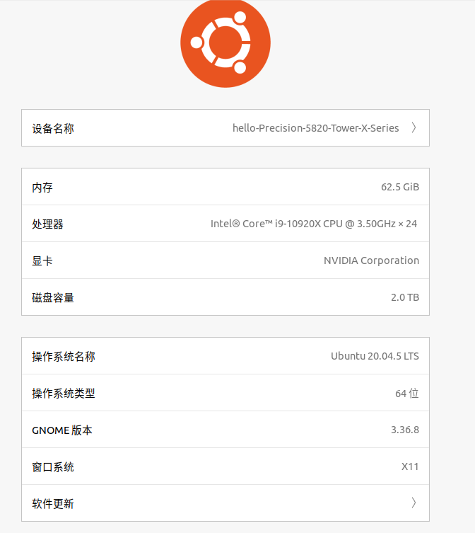
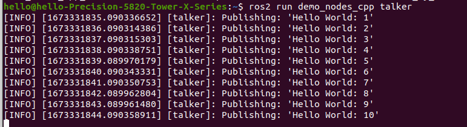
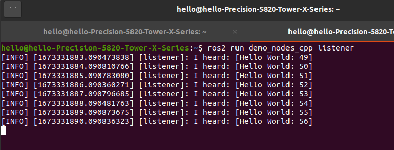
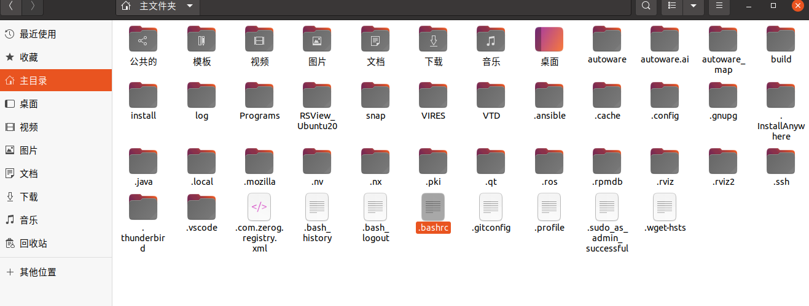
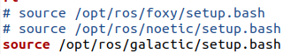
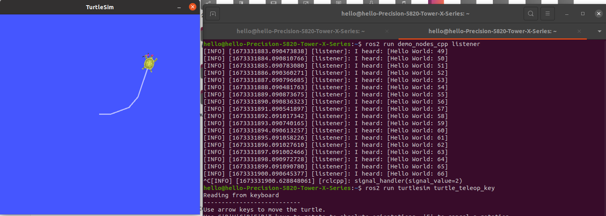
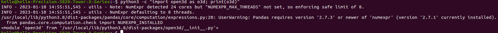
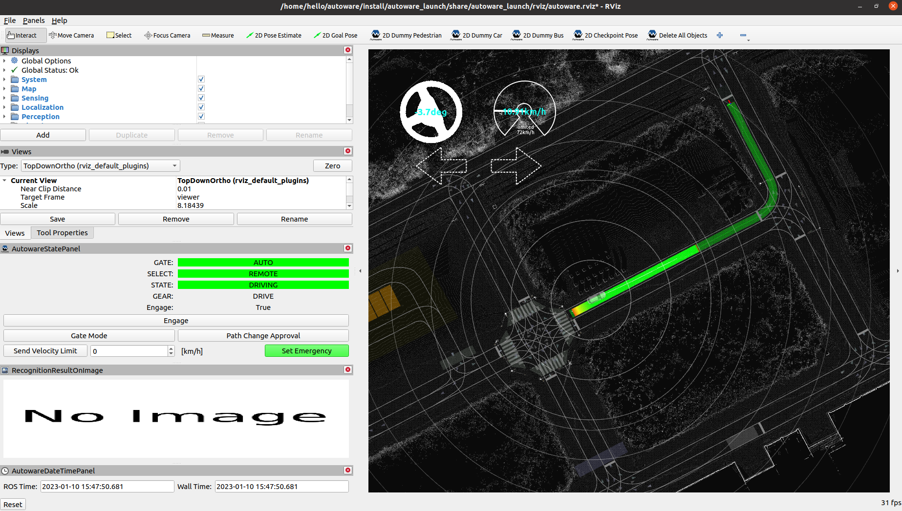

2023.1.10

本文用于记录Autoware.universe源代码安装的过程

# 环境配置



GPU：Nvidia RTX 3080

CUDA：12.0

nvidia driver version：525.60.13

**gcc version：9.4.0**

**g++ ersion：9.4.0**

Ubuntu 20.04自带pcl-1.10以及vtk 7

编译器版本与后续编译成功与否息息相关，本次是用9.4.0编译成功的，一开始使用7.5.0各种报错

软件源：


# 前置要求

安装过程全程必须使用科学上网，保持稳定的网络连接

[Ubuntu使用clash for windows的教程](https://www.cfmem.com/2021/09/linux-clash-for-windows-vpnv2ray.html?m=1)

[科学上网](https://sockboom.app/)

建议装多个gcc，g++版本（8和9选一个小版本进行安装）

**[gcc，g++版本切换](https://blog.csdn.net/qq_39779233/article/details/105124478)**

查看目前的gcc版本

```
gcc -v
g++ -v
```

查看已安装的版本

```
ls /usr/bin/gcc*
ls /usr/bin/g++*
```

进入到/usr/bin，查看目前gcc链接到哪一个版本

```
cd ~/usr/bin
ll gcc
ll g++
```

删除旧版本软链接

```
sudo rm /usr/bin/gcc
sudo rm /usr/bin/g++
```

建立新版本链接

```
sudo ln -s /usr/bin/gcc-9 /usr/bin/gcc
sudo ln -s /usr/bin/g++-9 /usr/bin/g++
```

查看切换后的版本

```
gcc -v
g++ -v
```

安装git

```
sudo apt-get -y update
sudo apt-get -y install git
```

配置开发环境，clone官方github的东西

```
git clone https://github.com/autowarefoundation/autoware.git -b galactic
cd autoware
```

## 最简单的依赖配置，使用官方的配置脚本

```
cd autoware
./setup-dev-env.sh
```

**本次过程手动安装了ROS2**，后续才使用autoware.universe的官方环境配置脚本，没有手动安装依赖，如果需要手动安装依赖，请参考[官方教程](https://autowarefoundation.github.io/autoware-documentation/galactic/installation/autoware/source-installation/)

# 手动安装ROS2 Galactic

如果你的电脑已经安装了ROS noetic或其他版本，多版本的ROS可以共存，只需要source 的时候来更换版本就OK了

比如有ros noetic 和ros2 galactic版本

使用noetic就

```
source /opt/ros/noetic/setup.bash
```

使用galactic就

```
source /opt/ros/galactic/setup.bash
```

**必须科学上网**

## 设置编码格式

```
locale  # check for UTF-8

sudo apt update && sudo apt install locales
sudo locale-gen en_US en_US.UTF-8
sudo update-locale LC_ALL=en_US.UTF-8 LANG=en_US.UTF-8
export LANG=en_US.UTF-8

locale  # verify settings
```

## 设置源

首先确保Ubuntu仓库可用

```
sudo apt install software-properties-common
sudo add-apt-repository universe
```

添加ROS2 GPG密钥

```
sudo apt update && sudo apt install curl
sudo curl -sSL https://raw.githubusercontent.com/ros/rosdistro/master/ros.key -o /usr/share/keyrings/ros-archive-keyring.gpg
```

把仓库添加到你的软件源列表中

```
echo "deb [arch=$(dpkg --print-architecture) signed-by=/usr/share/keyrings/ros-archive-keyring.gpg] http://packages.ros.org/ros2/ubuntu $(. /etc/os-release && echo $UBUNTU_CODENAME) main" | sudo tee /etc/apt/sources.list.d/ros2.list > /dev/null
```

## 安装ROS2

更新软件源

```
sudo apt update
```

更新你的Ubuntu软件

```
sudo apt upgrade
```

安装桌面版ROS2

```
sudo apt install ros-galactic-desktop
```

等待安装完成

安装开发包

```
sudo apt install ros-dev-tools
```

## 环境配置

source以下脚本

```
# Replace ".bash" with your shell if you're not using bash
# Possible values are: setup.bash, setup.sh, setup.zsh
source /opt/ros/galactic/setup.bash
```

## 进行测试

建立一个talker

```
source /opt/ros/galactic/setup.bash
ros2 run demo_nodes_cpp talker
```

效果如图：



再开一个终端，建立一个listener：

```
source /opt/ros/galactic/setup.bash
ros2 run demo_nodes_py listener
```

效果如图：



当你的电脑同时装了ROS和ROS2时，可能会报错，这时候需要把终端关掉，检查你根目录下的.bashrc中是否添加了ROS的source脚本代码，有的话用#注释掉






重新开一个新的终端source一下galactic文件夹下面的setup.bash，再进行上面的测试


进行经典的:turtle:测试

```
ros2 run turtlesim turtlesim_node
```

再开一个终端，用方向键移动:turtle:

```
ros2 run turtlesim turtle_teleop_key
```

效果如图



这样ROS2 galactic就基本安装完毕

# 安装环境依赖

耗时约1小时，快的话30分钟

这个过程必须保持**全程科学上网并且网络稳定**，其中有一个库下载的特别慢，open3d库

建议先使用清华的源把open3d安装好，没有pip的要先安装pip

```
sudo apt install python3-pip
```


```
pip3 install open3d -i https://pypi.tuna.tsinghua.edu.cn/simple
```

运行以下命令测试是否安装成功

```
python3 -c "import open3d as o3d;print(o3d)"
```

效果图，没有error就是安装成功了



然后运行官方的环境安装脚本

```
cd ~/autoware
./setup-dev-env.sh
```

中间有一个BECOME PASSWORD的东西，我填的123，不知道有什么用，应该不影响配置

询问y/N的全部选择y

顺利的话可以在1小时之内完成

# 配置工作空间

必须科学上网，通过vcstool拉取源码，时长视网速而定，有时候甚至要半个小时，非常慢

```
cd autoware
mkdir src
vcs import src < autoware.repos
```

完成后，需要安装ROS依赖包，先安装rosdep

```
rosdep update
rosdep install
```

然后使用rosdep来安装

```
source /opt/ros/galactic/setup.bash
rosdep install -y --from-paths src --ignore-src --rosdistro $ROS_DISTRO
```

这里是最多问题的地方，会报很多错误，最经典的就是Cannot locate rosdep definition for [xxx]

解决方法：https://blog.csdn.net/qq_42156603/article/details/126361137

这些都是缺少了相关依赖包，单独安装这些依赖包，xxx就是依赖包的名字，前面要加上ros版本号，比如ros-galactic，**依赖包的"_"要换成"-"**

比如launch_yaml -> ros-galactic-launch-yaml

```
sudo apt-get install ros-galactic-launch-yaml
```

如果还是不行就用：https://blog.csdn.net/liyuanjunfrank/article/details/122155262

进入以下网站https://github.com/ros/rosdistro

进入这个网站之后可以根据自己的ROS版本进入相应的路径下，里面有个distribution.yaml文件，打开这个yaml之后，就可以找到所有的依赖项。根据终端显示的错误，在yaml文件中查找缺失的依赖项，都有对应的网址，然后进入网址下载这个依赖，例如我缺少launch_testing的依赖，就可以去这个网址下面


进入之后如下图所示：


然后直接把整个文件下载下来，解压之后，将launch_testing这个文件夹放入到ros工作空间的src文件下面即可（autoware下面的src文件夹）。然后再次运行

```
rosdep install -y --from-paths src --ignore-src --rosdistro $ROS_DISTRO
```

如果提示还缺少别的依赖项，就继续去这个网站下载对应的依赖包，重复上面的步骤，直到不再报错。

# 编译

注意，一共要编译240多个包，如果数量比这个少很多的，肯定是vcs步骤出了问题，建议删掉整个autoware文件夹重新开始安装（这时依赖已经基本装好了，不会花很多时间）

编译也会有很多问题，有时候需要改CMakelist

```
cd ~/autoware
colcon build --symlink-install --cmake-args -DCMAKE_BUILD_TYPE=Release
```

出现问题要删掉build重新编译

问题1：

error: literal operator suffixes not preceded by ‘_’ are reserved for future ...

解决方法：更换更新的gcc以及g++版本，我用的是9.4.0

问题2：

fatal error: pcl/point_types.h: No such file or directory

以及

Cannot generate a safe runtime search path for target...\

libpcl xxx

pcl安装是个大坑

可能原因：pcl没有安装好，建议先卸载pcl，然后重新安装

```
sudo apt-get remove libpcl-dev
sudo apt-get install libpcl-dev pcl-tools
```

再检查一下有没有ROS依赖缺失，输入：

```
sudo apt-get install ros-galactic-desktop
rosdep install -y --from-paths src --ignore-src --rosdistro $ROS_DISTRO
```

一般来说，会出现要装pcl-tools的情况，那就按照上文安装环境依赖的办法，重新装依赖

问题3：

ISO C++ prohibits anonymous structs [-pedantic]

解决方法：进入相应报错的包的目录，打开CMakelist.txt

找一个地方添加以下语句，保存：

```cmake
add_compile_options(-Wn-pedantic)
```

还有其他问题的话可以补充


# 测试

[直接按着官方教程来测试，非常简洁明了](https://autowarefoundation.github.io/autoware-documentation/galactic/tutorials/ad-hoc-simulation/planning-simulation/)，我就不翻译了

#### 1. Launch Autoware

先下载官方demo

```
gdown -O ~/autoware_map/ 'https://docs.google.com/uc?export=download&id=1499_nsbUbIeturZaDj7jhUownh5fvXHd'
unzip -d ~/autoware_map ~/autoware_map/sample-map-planning.zip
```

然后运行demo

```
source ~/autoware/install/setup.bash
```

```
ros2 launch autoware_launch planning_simulator.launch.xml map_path:=$HOME/autoware_map/sample-map-planning vehicle_model:=sample_vehicle sensor_model:=sample_sensor_kit
```

注意：Note that you cannot use `~` instead of `$HOME` here.

If `~` is used, the map will fail to load.

#### 2. Add Autoware State Panel

加入状态panel

This panel is useful when running planning simulations. To add the panel, click `Panels -> Add new panel`, select `AutowareStatePanel`, and then click `OK`.


#### 3. Set an initial pose for the ego vehicle

车辆姿态的快捷键是P，目的地的快捷键是G


a) Click the `2D Pose estimate` button in the toolbar, or hit the `P` key.

b) In the 3D View pane, click and hold the left-mouse button, and then  drag to set the direction for the initial pose. An image representing  the vehicle should now be displayed.

**Remember to set the initial pose of the car in the same direction as the lane.**

**To confirm the direction of the lane, check the arrowheads displayed on the map.**

#### 4. Set a goal pose for the ego vehicle

a) Click the `2D Goal Pose` button in the toolbar, or hit the `G` key.

b) In the 3D View pane, click and hold the left-mouse button, and  then drag to set the direction for the goal pose. If done correctly, you will see a planned path from initial pose to goal pose.


#### 5. Engage the ego vehicle

Now you can start the ego vehicle driving by clicking the `Engage` button in `AutowareStatePanel`. Alteratively, you can manually engage the vehicle by running the following command:

```
source ~/autoware/install/setup.bash
ros2 topic pub /autoware/engage autoware_auto_vehicle_msgs/msg/Engage "engage: true" -1
```


### Parking scenario

Set an initial pose and a goal pose, and engage the ego vehicle.


When the vehicle approaches the goal, it will switch from lane driving mode to parking mode.

After that, the vehicle will reverse into the destination parking spot.


其他就不翻译了，自行操作一下

效果图


# 总结

得益于科学上网，整个过程耗时1天，还算顺利，后续将进行Carla和autoware的联合仿真调试